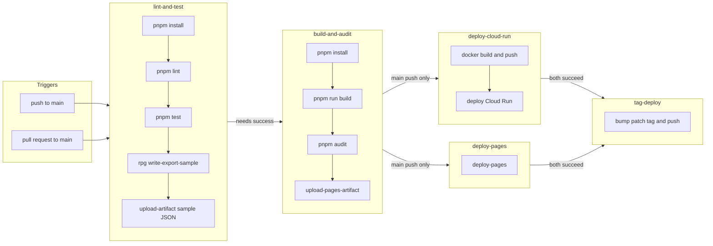

<p align="center">
  
</p>

<h1 align="center">Rick and Morty Portal</h1>

<p align="center">
  <a href="https://github.com/VRossi18/rick-morty-portal/actions/workflows/pipeline.yml">
    
  </a>
</p>

A small **React** app that browses characters from the [Rick and Morty API](https://rickandmortyapi.com/), with a **character detail** view, client-side routing, and a portal-style transition between the grid and the detail screen. This repository doubles as a **hands-on sandbox for learning GitHub Actions**: workflows, jobs, automated deploys, and keeping `main` green with lint, tests, and security audit. Production is published to **GitHub Pages** and **Google Cloud Run** on every push to `main`. It is also a place to **go deeper with the stack** (React, TypeScript, Vite, routing, i18n, testing) and to **experiment with LLM-backed gameplay**—for example a GM or rules assistant grounded in the rules you encode in the app.

---

## Why this project exists

The **primary goal** is to get comfortable with **GitHub Actions** in a real (but small) codebase: defining when workflows run, wiring Node and pnpm, splitting work across jobs, publishing to **GitHub Pages** and **Google Cloud**, and failing fast when lint or tests break. The UI is the fun part; the pipeline is the lesson.

Beyond CI/CD, the project is meant to grow a **playable Rick and Morty–inspired RPG loop** where a **large language model** can help run a session (narration, rolls, or structured prompts tied to the character sheet). The current **`/rpg`** route includes point-buy creation, racial modifiers and drawbacks, a **cheat-sheet** of derived values (HP, physical/magical attack channels, social pool, DEX speed tiers, **stealth** with a small racial knack for Bird-Person and Parasites), per-race **skill sets** (two attacks, support, item with out-of-combat use), and **JSON export** (`schemaVersion` **3** in [`buildCharacterSheetExport`](src/components/rpg/buildCharacterSheetExport.ts)). The UI also offers **Create character**: confirm in a dialog, then a **summary sheet** with the full build, export from there, and a placeholder **Start game** control. Full 27-point spend and a character name are required before export or creation. The pipeline publishes a **sample JSON artifact** so the schema stays documented in CI. Successful **production deploys on `main`** bump an automatic **SemVer-style patch tag** (`v1.0.1`, `v1.0.2`, …) using [`.github/version-prefix`](.github/version-prefix). Future work can add session UI, an API/MCP surface, or richer prompts while keeping the static GitHub Pages story where possible.

### What the pipeline does

| Job                     | When                                                   | Steps                                                                                                                                       |
| ----------------------- | ------------------------------------------------------ | ------------------------------------------------------------------------------------------------------------------------------------------- |
| **Lint and test**       | Every push and PR to `main`                            | `pnpm install` → `pnpm lint` → `pnpm test` → `pnpm run rpg:write-export-sample` → upload **`rpg-character-export-sample`**                  |
| **Build and audit**     | After lint and test succeed                            | `pnpm install` → `pnpm run build` → `pnpm audit` → (on `main` push only) upload `dist` as a Pages artifact                                  |
| **Deploy Cloud Run**    | After build, only on **`push` to `main`**              | Docker image (nginx + static `dist`) → GHCR → **Artifact Registry** → **Cloud Run** (`rick-morty-portal`); smoke tests on `/health` and `/` |
| **Deploy GitHub Pages** | After build, only on **`push` to `main`**              | `actions/deploy-pages` publishes the uploaded artifact                                                                                      |
| **Tag release (patch)** | After **both** deploys succeed on **`push` to `main`** | Reads [`.github/version-prefix`](.github/version-prefix), bumps patch tag (`v1.0.1`, …), pushes to origin                                   |

The production build runs [`scripts/copy-404.mjs`](scripts/copy-404.mjs) after Vite so **`dist/404.html`** mirrors `index.html`. That helps the hosted SPA when users refresh or open a deep link. Unknown in-app routes are handled by a dedicated **404 page** (React Router catch-all `path="*"`), so client navigation to a missing path shows the themed UI instead of a blank outlet.

### Hosting (production)

| Target               | What runs                                                                     | Notes                                                                              |
| -------------------- | ----------------------------------------------------------------------------- | ---------------------------------------------------------------------------------- |
| **GitHub Pages**     | Static `dist` from the main Vite build (`base`: `/rick-and-morty-portal/`)    | Project-site URL under the repo name                                               |
| **Google Cloud Run** | Same app in a container ([`Dockerfile`](Dockerfile) + nginx on port **8080**) | Build uses `VITE_BASE=/` for root hosting; deploy via Workload Identity Federation |

Cloud Run requires GitHub Actions secrets: `GCP_WORKLOAD_IDENTITY_PROVIDER`, `GCP_SERVICE_ACCOUNT`, `GCP_REGION`, `GCP_PROJECT_ID`, and `GCP_REGISTRY_NAME`. The live service URL is printed in the deploy job log (`gcloud run services describe rick-morty-portal`).



Workflow file: [`.github/workflows/pipeline.yml`](.github/workflows/pipeline.yml). In the repo **Settings → Pages**, the source should be **GitHub Actions** so the Pages deploy job can run. Configure the GCP secrets above for Cloud Run. The **tag-deploy** job sets **`contents: write`** only on that job so it can push tags; the rest of the workflow keeps the default `contents: read` where applicable.

---

## Tech stack

- **Runtime / tooling:** Node.js **24+**, **pnpm 10** (see `engines` in [`package.json`](package.json))
- **Hosting:** GitHub Pages + **Google Cloud Run** (Docker / Artifact Registry / Workload Identity Federation in CI)
- **UI:** React 19, TypeScript, Vite 8
- **Routing / motion:** React Router 7, Framer Motion (shared `layoutId` on the character image, `AnimatePresence` between routes)
- **Styling:** Tailwind CSS 4, FlyonUI, `clsx` / `tailwind-merge`
- **Data:** Axios (`GET /character` for lists, `GET /character/:id` for details — see [`CharacterService`](src/services/characters.ts))
- **i18n:** `i18next` + `react-i18next`, copy in [`src/locales/pt/common.json`](src/locales/pt/common.json) / [`src/locales/en/common.json`](src/locales/en/common.json), bootstrap in [`src/i18n.ts`](src/i18n.ts)
- **Quality:** ESLint (flat config), Vitest, Testing Library, jsdom; **tsx** (dev) to run [`scripts/write-rpg-character-export-sample.ts`](scripts/write-rpg-character-export-sample.ts) for the CI JSON fixture
- **Learning / experiments:** More real-world practice with the stack above; upcoming **LLM integration** (hosted APIs, structured prompts, or MCP) to support a **playable** tabletop-style loop alongside the UI

### Performance and React best practices

The UI is kept **as lean as practical** for a Vite SPA: routes are **lazy-loaded** with code splitting (each page is its own chunk), list cards and filter handlers avoid unnecessary re-renders where it matters, and updates from search or API responses use **React transitions** so typing stays responsive. The production bundle favors a small initial entry and loads heavier views (for example **`/rpg`**) only when visited.

Front-end choices follow **[Vercel React Best Practices](https://skills.sh/vercel-labs/agent-skills/vercel-react-best-practices)** (bundle size, re-render optimization, rendering performance) as applied to this stack—not Next.js/RSC rules, but the same performance mindset for client-side React.

---

## Current features

- Paginated grid of characters from the public API
- **Filters** — search by name (debounced), status, gender, species, and type (selects backed by the API catalog); wired to [`CharacterService.getCharacters`](src/services/characters.ts)
- **Click a card** (`cursor: pointer`) to open **`/character/:id`**, with a short “portal” feel: other cards dim / ease aside, the image **animates into** the detail layout, and an optional radial overlay uses the click origin when navigation passes `location.state`
- **Character detail** page: full fields from the API (status, species, type, gender, origin, location, episode count, created), loading and error handling (including 404)
- **Back** link to the home grid
- Loading and error states on the list
- **About me** page at **`/about`** (author bio, portrait, contact / social links)
- **Internationalization (PT / EN)** — UI strings live in locale JSON; language is stored in **`localStorage`** (`portal.locale`, default `pt`); **`document.documentElement.lang`** stays in sync; **navbar flag switcher** ([`LanguageSwitcher`](src/components/LanguageSwitcher.tsx))
- Light / dark theme toggle
- Responsive layout
- **Rick and Morty RPG** — point-buy **character creator** at **`/rpg`**: races with modifiers and drawbacks, 27-point pool, scores 8–15 before racial, live totals, per-race **skills** (attacks / support / item), **derived stats** (HP, attack channels, social pool, DEX cadence, **stealth** with +2 racial ease for Bird-Person and Parasites), **cheat-sheet** on the page, **Export JSON** (confirm dialog), and **Create character** (second confirm, then a **summary modal** with the full sheet, export from there, and a non-functional **Start game** button for upcoming flow). See [`CharacterSheetContainer`](src/components/rpg/CharacterSheetContainer.tsx), [`useCharacterCreation`](src/components/rpg/useCharacterCreation.ts), [`rpgDerivedSheet`](src/components/rpg/rpgDerivedSheet.ts), and [`buildCharacterSheetExport`](src/components/rpg/buildCharacterSheetExport.ts).
- **Custom 404 page** — any unknown route (e.g. `/dimensao-perdida`) renders [`NotFoundPage`](src/pages/NotFoundPage.tsx) inside the main shell (navbar + theme toggle stay visible). Visual design is inspired by [this CodePen](https://codepen.io/hkmtqffr/pen/dVPewm): spinning starfield, large **“44”** with a Rick and Morty portal image in the middle, localized message (PT / EN), and a **“GET ME HOME”** / **“ME LEVA PARA CASA”** link back to **`/characters`**. Styles live in [`src/styles/not-found.css`](src/styles/not-found.css); the portal asset is served from [`public/404/portal.png`](public/404/portal.png) via `import.meta.env.BASE_URL`. Animations respect `prefers-reduced-motion`.
- **`import.meta.env.BASE_URL`** as the router `basename` — GitHub Pages subpath in the default build; root path when building for Cloud Run (see [`vite.config.ts`](vite.config.ts))

---

## Roadmap

1. **LLM-playable tabletop RPG** — evolve **`/rpg`** into a session you can run with an LLM (session UI, richer prompts, optional small backend or MCP) while keeping the static app and GitHub Pages story in mind; JSON export is already the first integration surface for external tools

---

## Getting started

**Prerequisites:** Node **24** or newer, **pnpm** 10 (within the range declared in `package.json`).

```bash
git clone https://github.com/VRossi18/rick-morty-portal.git
cd rick-morty-portal
pnpm install
pnpm dev
```

Open the URL Vite prints (usually `http://localhost:5173`). In dev, the app lives at the root path. In production, **GitHub Pages** uses the repo subpath (`/rick-and-morty-portal/`); **Cloud Run** uses `/` (see `VITE_BASE` in the deploy job).

To try the 404 page locally, open any path that is not registered (for example `http://localhost:5173/skjdfb`).

### Scripts

| Command                        | Description                                                                                                                 |
| ------------------------------ | --------------------------------------------------------------------------------------------------------------------------- |
| `pnpm dev`                     | Start dev server with HMR                                                                                                   |
| `pnpm build`                   | Typecheck, Vite production build, then copy `dist/index.html` → `dist/404.html` for SPA hosting                             |
| `pnpm preview`                 | Preview the production build locally                                                                                        |
| `pnpm lint`                    | Run ESLint on the project                                                                                                   |
| `pnpm test`                    | Run Vitest once (CI mode)                                                                                                   |
| `pnpm test:watch`              | Run Vitest in watch mode                                                                                                    |
| `pnpm rpg:write-export-sample` | Write `artifacts/rpg-character-export.sample.json` (same schema as the UI export; used in CI for the downloadable artifact) |

These mirror what runs in GitHub Actions so local results should match CI (the `404.html` step runs inside `pnpm build`; the sample JSON step runs in **Lint and test** after tests).
